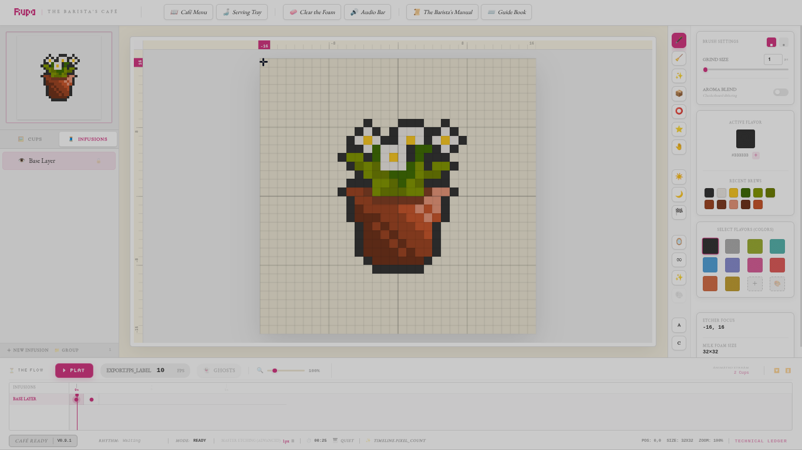

[](./docs/pubs/releases/v0.10.1.md)
[](./docs/developers/architecture.md)
[](https://svelte.dev)

# Rupa Pixel Editor ☕

**Rupa** is a professional-grade, meditative pixel art editor designed for digital baristas. It combines a keyboard-first workflow with a "Cottagecore" aesthetic, turning pixel art into a tactile craft of digital brewing.


---

## ✨ Features (v0.10.1: The Ergonomic Sanctuary)

- **The Selective Harvest**: Direct export support for **Selected Layers** and **Groups**, streamlining professional asset generation.
- **Pigment Station v2**: High-precision color engine with 8-character HEX support and decimal-accurate HSLA math.
- **Aroma Blend**: Professional dithered blending integrated into the brush engine for classic pixel transitions.
- **Flavor Library**: Persistent palette management with automatic **Dark-First (A11y)** sorting and GIMP Palette (.gpl) support.
- **Chronos Export**: High-fidelity export engine with WebM Header Patching for perfect seekable videos.
- **Seamless Atmosphere**: Automatic audio activation on first interaction, preserving the sanctuary's generative piano soundscapes.
- **Barista Ecosystem**: A sun-drenched sanctuary with tactile feedback and industrial-scale performance.

## 🖼️ Gallery

<div align="center">
  
  
</div>

## 🏗️ Architectural Sovereignty

Rupa follows a strict **5-Layer Modular Monolith** pattern, governed by the **3S (S3) Philosophy**:

1.  **Secure (S1)**: Zero-trust data sanitization and boundary-first security.
2.  **Sustain (S2)**: Maintainable, clear code aligned with the **Aesthetic-Natural** principle.
3.  **Scalable (S3)**: High-performance algorithms and modularity for industrial-scale projects.

### System Layers:

1. **UI Layer**: Pure presentational Svelte components.
2. **State Layer**: Reactive source of truth using Svelte 5 Runes.
3. **Service Layer**: Business logic and state orchestration.
4. **Engine Layer**: Hardware bridges (Audio, Input normalization).
5. **Logic Layer**: Pure, stateless mathematical algorithms.

## 🚀 Getting Started

### Prerequisites

- Node.js & npm
- [Bun](https://bun.sh/) (recommended for speed)

### Installation

```bash
git clone https://github.com/reasnovynt/Projects/reasnov/rupa-pixel-editor.git
cd rupa-pixel-editor
npm install
```

### Development

```bash
# Start Vite and Electron simultaneously
npm run dev:all
```

## 🐧 Linux Troubleshooting

If you encounter issues starting the application on Linux (e.g., "The SUID sandbox helper binary was found, but is not configured correctly"), you may need to enable unprivileged user namespaces or run with the sandbox disabled manually:

```bash
# Option A: Fix your system (Recommended)
sudo sysctl -w kernel.unprivileged_userns_clone=1

# Option B: Run with flags if Option A is not possible
# npm run electron:dev -- --no-sandbox
```

## 📖 Documentation

- [User Guide](./docs/USER_GUIDE.md)
- [Developer Specs](./docs/developers/specs.md)
- [Latest Release Notes](./docs/pubs/releases/v0.10.1.md)

---

_"We do not just paint pixels; we etch moments into the crema of time."_
