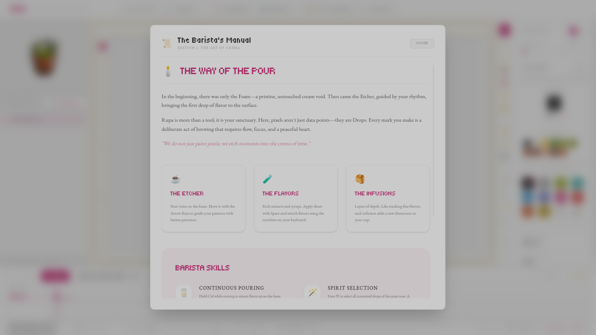

# Rupa Pixel Editor

**Rupa Pixel Editor** is a professional-grade desktop application for creating pixel art through a keyboard-centric interface. Inspired by the philosophy of "Rupa" (form) and the traditional art of "Sulam" (Stitching), it offers a methodical, precise, and meditative drawing experience.

Built with **Svelte 5** and **Electron**, Rupa eliminates the mouse in favor of absolute keyboard precision.


## ✨ Key Features

- **Keyboard-Centric Workflow**: Navigate the grid using arrow keys with zero-latency response.
- **Digital Stitching**: Use the **Stitch-Flow** mode (Hold `Shift`) to "pull the thread" and color paths as you move.
- **Artisan Bloom Cursor**: A dynamic inversion cursor that ensures visibility on any color without visual clutter.
- **Color Palette & Picker**: Full control over your "threads" with a keyboard-driven color selection system.
- **Pro Export Engine**: Export your creations as sharp PNGs or optimized SVGs.
- **Retro Audio Feedback**: Real-time synthesized SFX for movement and drawing, reinforcing the tactile experience.

## 🖼️ Gallery



## ⌨️ Controls

| Key                             | Action                                |
| :------------------------------ | :------------------------------------ |
| `Arrow Keys`                    | Move Active Cell                      |
| `Space`                         | Stitch (Color Pixel)                  |
| `Backspace` / `Delete`          | Unstitch (Clear Pixel)                |
| `Ctrl + Space`                  | Unstitch (Clear Pixel)                |
| `Shift` (Hold)                  | **Stitch-Flow**: Auto-color on move   |
| `Ctrl + Shift` (Hold)           | **Unstitch-Flow**: Auto-clear on move |
| `I` / `Alt + Space`             | Eyedropper (Pick color)               |
| `C`                             | Open Color Picker                     |
| `P` / `K`                       | Open Command Palette                  |
| `E` / `Ctrl + S`                | Export Artwork                        |
| `Ctrl + Z`                      | Undo                                  |
| `Ctrl + Shift + Z` / `Ctrl + Y` | Redo                                  |
| `?` / `F1`                      | Show Help                             |
| `Esc`                           | Dismiss UI / Clear Selection          |

## 🚀 Getting Started

### Prerequisites

- [Node.js](https://nodejs.org/) (v18 or higher)
- [npm](https://www.npmjs.com/)

### Installation

1. Clone the repository:

   ```bash
   git clone https://github.com/reasnov/rupa-pixel-editor.git
   cd rupa-pixel-editor
   ```

2. Install dependencies:
   ```bash
   npm install
   ```

### Running the App

Start the Vite development server and Electron window simultaneously:

```bash
npm run dev:all
```

## 🛠 Tech Stack

- **Framework**: [Svelte 5](https://svelte.dev/) (Runes)
- **Desktop**: [Electron](https://www.electronjs.org/)
- **Styling**: [Tailwind CSS 4.0](https://tailwindcss.com/)
- **Language**: [TypeScript](https://www.typescriptlang.org/)

## 📜 License

This project is licensed under the **MIT License** - see the [LICENSE](LICENSE) file for details.

## 🤝 Contributing

We welcome contributions! Please see [CONTRIBUTING.md](CONTRIBUTING.md) for guidelines.

---

Created with ❤️ by [reasnov](https://github.com/reasnov)
