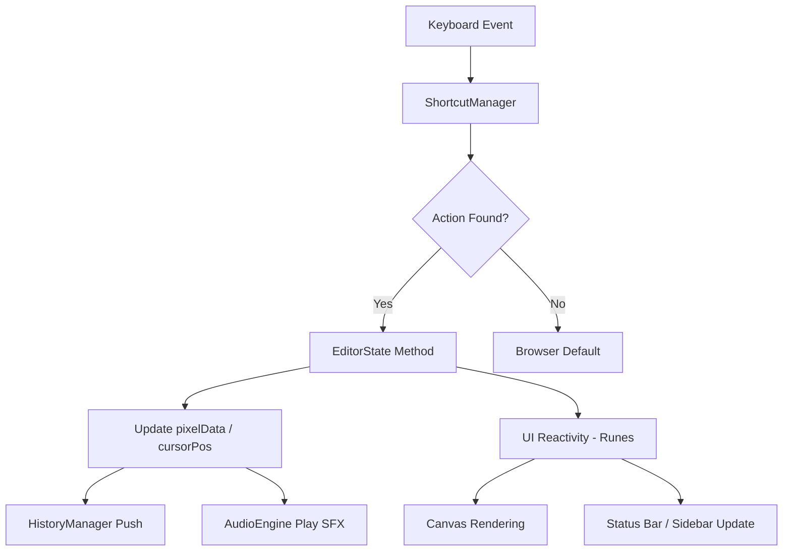

# Architecture Documentation: Rupa Pixel Editor

## 1. Executive Summary

Rupa Pixel Editor is a specialized desktop environment for pixel art, built with a "Keyboard-First" philosophy. The architecture leverages **Svelte 5 (Runes)** for reactive UI management and **Electron** for a native desktop experience. The system is designed around the metaphor of "Digital Stitching," where the canvas is treated as a linen and the cursor as a needle.

---

## 2. Technology Stack

- **Runtime**: Node.js / Electron
- **Frontend Framework**: Svelte 5 (utilizing Runes: `$state`, `$derived`, `$effect`)
- **Build Tool**: Vite
- **Styling**: Tailwind CSS 4.0
- **Language**: TypeScript
- **State Management**: Reactive Class-based Store (Singleton)

---

## 3. High-Level System Design

Rupa follows the standard Electron **Main-Renderer** architecture:

1.  **Main Process (`electron/main.cjs`)**: Handles window creation, native OS integration, and lifecycle management.
2.  **Renderer Process (`src/`)**: The Svelte application where the drawing logic and UI reside.
3.  **The Weaver's Engine**: A collection of TypeScript modules that handle non-UI concerns like command history, shortcut mapping, and file exports.

---

## 4. Core Systems

### 4.1 The Artisan's State (`EditorState`)
The heart of the application is the `EditorState` class (`src/lib/state/editor.svelte.ts`). Unlike traditional stores, it uses Svelte 5 Runes to provide fine-grained reactivity.

-   **Linen Data**: `pixelData` is a flat array of Hex strings representing the grid.
-   **Needle Tracking**: `cursorPos` ({x, y}) tracks the active cell.
-   **Reactive Projections**: 
    -   `cameraTransform`: A `$derived` string that calculates CSS `translate` and `scale` values to keep the cursor centered during zoom.
    -   `usedColors`: A `$derived` set that scans the canvas to provide a dynamic palette of colors currently in use.
-   **Escape Stack**: A LIFO (Last-In, First-Out) stack that manages the closing of nested UI elements (modals, palettes) via the `Esc` key.

### 4.2 The Weaver's Map (`ShortcutManager`)
Located in `src/lib/engine/shortcuts.ts`, this system translates raw keyboard events into semantic "Studio Actions."

-   **Priority Matching**: Shortcuts are sorted by modifier count (Ctrl+Shift+Key vs Key). The manager finds the "Best Match" to ensure complex commands don't trigger simpler ones.
-   **Context Awareness**: The global listener in `+page.svelte` ignores shortcuts when the user is typing in input fields (e.g., in the Color Picker).

### 4.3 History Engine (`HistoryManager`)
Implements the **Command Pattern** for Undo/Redo functionality.

-   **Optimization**: Actions are only pushed to the stack if a color change actually occurs.
-   **Constraints**: Capped at 500 steps to maintain memory efficiency in the Electron environment.

### 4.4 Export Engine
A dual-format engine for transforming the digital linen into artifacts:

-   **SVG (Vector)**: Uses a row-scanning algorithm to merge adjacent pixels of the same color into a single `<rect>`, significantly reducing the XML size for complex patterns.
-   **PNG (Raster)**: Utilizes a hidden HTML5 Canvas. It disables image smoothing (`imageSmoothingEnabled = false`) to ensure "pixel-perfect" sharpness regardless of the export scale.

---

## 5. UI & Rendering Strategy

### 5.1 Grid Performance
The grid is rendered using **CSS Grid**. While traditional pixel editors use Canvas for rendering, Rupa uses DOM elements for pixels to leverage Svelte's efficient reconciliation and to allow for easier styling of individual "stitches" (e.g., the block selection overlay).

### 5.2 The Camera Protocol
The viewport movement is handled by applying CSS transforms to the container.
-   **Zoom Focal Point**: Always centered on the `cursorPos`.
-   **Rhythmic Guides**: A separate layer of absolute-positioned lines provides an 8-bit rhythmic structure (every 8 pixels), helping the artisan maintain symmetry.

---

## 6. Interaction Modes

The architecture supports three primary interaction states:

1.  **Standard Mode**: Free movement and single stitching.
2.  **Stitch-Flow (Shift)**: Continuous coloring while moving.
3.  **Block Looming (Shift + Alt)**: Defines a rectangular selection area that is "committed" (filled) when the keys are released.

---

## 7. Data Flow Diagram

---

## 8. Development Guidelines

-   **Logic Location**: UI logic belongs in `.svelte` components. Business logic (drawing, history, math) must reside in the `engine/` or `state/` directories.
-   **Reactivity**: Prefer `$derived` over `$effect` for state projections to keep the data flow predictable and debuggable.
-   **Performance**: Avoid looping through the entire `pixelData` array inside a `$derived` that runs on every cursor move unless necessary.
